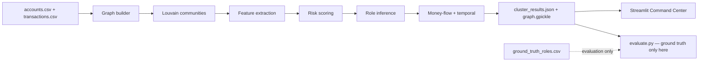

# Fraud Network Graph Intelligence

**Unsupervised graph-based intelligence for coordinated fraud rings — built for investigators, not black-box scores.**

M.V.P - https://kan9667-fraud-network-graph-intelligence-app-59zwzv.streamlit.app
Demo video - https://drive.google.com/file/d/1xhTqkjfpbvltfenGu8xsfXKZuSFJm1uy/view?usp=sharing

---

## Problem

Traditional fraud systems often score **individual transactions** or accounts in isolation. Real money-mule and scam rings operate as **coordinated networks**: shared devices, rapid pass-throughs, concentrators, and cash-out endpoints.

Labelled training data is scarce, brittle, and often unavailable at investigation time. Manually written rule packs lag behind new ring structures.

## Solution

An **unsupervised** pipeline that:

1. Builds a multi-relational graph from accounts and transactions  
2. Detects candidate communities (Louvain)  
3. Scores clusters with multi-factor risk (identity reuse, structure, money flow, temporal signals)  
4. Infers **probable** operational roles (mule, coordinator, consolidator, cash-out, victim)  
5. Surfaces money-flow paths, rapid forwarding, and exit volume  
6. Presents an investigator **Command Center** in Streamlit with case export  

**Detection never uses labels.** Synthetic ground truth exists only for offline evaluation.

---

## Key innovation

| Capability | Why it matters |
|------------|----------------|
| Graph + community detection | Finds rings, not lone outliers |
| Multi-factor risk scoring | Combines identity, structure, flow, and time |
| Role inference (heuristic) | Explains *who may be doing what* |
| Money-flow + temporal intelligence | Traces funds and rapid pass-through |
| Evaluation-only ground truth | Measures recovery without contaminating detection |
| Investigator dashboard | Demo-ready case workflow and exportable evidence |

---

## Architecture



### End-to-end pipeline

| Step | Module | Input | Output |
|------|--------|-------|--------|
| Synthetic data (optional) | `generate_data.py` | seed config | `data/accounts.csv`, `data/transactions.csv`, eval GT |
| Detection | `detect_fraud.py` | accounts + transactions **only** | `output/graph.gpickle`, `output/cluster_results.json` |
| Dashboard | `app.py` | detection outputs | investigator UI |
| Evaluation | `evaluate.py` / `src/evaluate.py` | detection + **GT** | `output/evaluation_report.json` |

---

## Graph construction

Nodes = accounts. Edges from:

- **Transactions** (count / volume / first–last time)  
- **Shared phone / device / IP** (strong identity links)

Weights combine transaction activity with shared-identity edges.

## Community detection

**Louvain** clustering (`networkx`, fixed seed) produces candidate networks. Clusters below a minimum size are ignored for case scoring.

## Risk scoring

Weighted combination of unsupervised feature scores (must sum to 1.0):

- Network structure  
- Identity reuse  
- Transaction velocity  
- Money-flow concentration  
- Rapid forwarding  
- Temporal anomaly  
- External counterparty  

Levels: **LOW / MEDIUM / HIGH / CRITICAL** from configurable thresholds.

## Role inference

Within **suspicious (MEDIUM+)** clusters only, accounts receive algorithmically inferred roles:

- probable mule  
- probable coordinator  
- probable consolidator  
- probable cash-out  
- suspected victim  
- unknown  

**LOW-risk clusters stay unclassified** to avoid mass false role labels.  
Wording is always probabilistic — never “this account is criminal.”

## Money-flow & temporal analysis

- Internal vs external / exit volumes  
- Estimated forwarding ratios  
- Top directed paths (volume-prioritized, not exhaustive enumeration)  
- Rapid forwarding: inbound then outbound within a configurable window (default 24h)

## Investigator dashboard

Navigation:

1. **Command Center** — metrics, risk distribution, recommended case  
2. **Fraud Cases** — filterable queue  
3. **Network Investigation** — risk, roles, graph  
4. **Account Investigation** — single-account evidence  
5. **Money Flow** — volumes and paths  
6. **Timeline** — chronological transfers  
7. **Evidence** — narrative + JSON/Markdown download  

**Demo mode:** “Open recommended case” selects the strongest MEDIUM+ case from **detection outputs only** (score, volume, rapid-forward, role evidence) — never ground truth.

On Streamlit Cloud cold start, the app bootstraps missing data/detection artifacts programmatically (no subprocess required).

---

## Evaluation methodology (offline only)

`src/evaluate.py` is the **only** production-adjacent module that may read `data/ground_truth_roles.csv`.

It measures:

- Account-level precision / recall / F1 (MEDIUM+ vs HIGH/CRITICAL)  
- Per-ring recovery (overlap F1 against planted rings)  
- Role classification metrics  
- Risk-score separation  
- Signal ablation (identity / behavior / temporal / combined)

### Current evaluation snapshot (synthetic run)

| Metric | Result |
|--------|--------|
| Account precision (MEDIUM+) | **100%** |
| Account recall (MEDIUM+) | **68.09%** |
| Account F1 (MEDIUM+) | **81.01%** |
| Rings recovered (MEDIUM+) | **3 / 4** |
| Behavior-only ablation | **4 / 4** rings recovered |
| Automated tests | **67+** passing |

**Important limitation:** The **low-identity-signal** behavioral ring (ring_3) was **structurally recovered** by community detection (perfect membership match in a LOW cluster) but **under-ranked** by the combined risk score (below MEDIUM). Behavior-only ablation lifts it — a calibration gap, not a graph-construction failure.

Do **not** interpret these numbers as real-world production accuracy. They describe recovery of **synthetic** scenarios under fixed thresholds.

---

## Responsible use

> Role labels are algorithmic inferences based on transaction and network behavior and are not confirmed identities.

- No ground truth in detection or the dashboard  
- Reports must not contain `is_fraud_ring`, `fraud_ring_id`, or `ground_truth_role`  
- Investigators retain final judgment  

---

## Installation

```bash
python3 -m venv venv
source venv/bin/activate   # Windows: venv\Scripts\activate
pip install -r requirements.txt
```

### Requirements

Runtime:

- pandas  
- networkx  
- pyvis  
- streamlit  
- faker  
- scikit-learn  
- python-dotenv  

Dev / CI:

- pytest  

---

## Local run

```bash
# 1) Synthetic data (optional if data/ already present)
python3 generate_data.py

# 2) Unsupervised detection
python3 detect_fraud.py

# 3) Offline evaluation (uses ground truth)
python3 evaluate.py

# 4) Tests
python3 -m pytest tests/ -q

# 5) Dashboard
streamlit run app.py
```

Fresh clone / Streamlit Cloud: launch `streamlit run app.py` — the app generates data and runs detection if artifacts are missing.

---

## Streamlit Cloud deployment

1. Push repository to GitHub  
2. Create a Streamlit Cloud app pointing at `app.py`  
3. Python version 3.10+ recommended  
4. No secrets required for the demo (synthetic data)  
5. Ensure `requirements.txt` is at repo root  

Cold start will:

1. Create `data/` accounts & transactions if missing  
2. Run detection into `output/` if graph / results missing  
3. Serve the Command Center  

Detection still **does not** load evaluation ground truth.

---

## Project structure

```text
fraud-hackathon/
├── app.py                 # Streamlit Command Center
├── generate_data.py       # Synthetic scenarios + eval GT
├── detect_fraud.py        # Unsupervised detection (no GT)
├── evaluate.py            # CLI evaluation entrypoint
├── metrics.py             # Thin wrapper → evaluate
├── visualize.py           # Offline full-graph HTML export
├── requirements.txt
├── README.md
├── data/
│   ├── accounts.csv
│   ├── transactions.csv
│   └── ground_truth_roles.csv   # evaluation only
├── output/
│   ├── graph.gpickle
│   ├── cluster_results.json
│   ├── evaluation_report.json
│   └── evaluation_report.md
├── src/
│   ├── config.py
│   ├── loader.py
│   ├── graph_builder.py
│   ├── features.py
│   ├── risk_scorer.py
│   ├── role_classifier.py
│   ├── money_flow.py
│   ├── evaluate.py
│   ├── dashboard_data.py
│   └── cluster_viz.py
└── tests/
```

---

## Known limitations

1. **Risk calibration:** Combined scoring can under-rank pure behavioral rings that Louvain already isolates.  
2. **No HIGH/CRITICAL** clusters in the current synthetic draw — high-threshold metrics are zero by construction.  
3. **Role coverage is intentionaly low** outside MEDIUM+ cases (reduces false cash-out / mule spam).  
4. **Heuristic roles** are not a trained classifier; coordinator / consolidator F1 can be weak.  
5. **Synthetic data** does not prove production performance.  
6. PyVis physics can be busy for large graphs — cases are filtered to cluster subgraphs.

---

## What we do *not* claim

- Perfect fraud detection  
- Confirmed criminal identities  
- Production AML certification  
- That evaluation numbers generalize beyond this synthetic benchmark  

---

## License / hackathon context

Built as a public-safety oriented **hackathon prototype**: unsupervised graph intelligence + investigator UX + honest evaluation.
